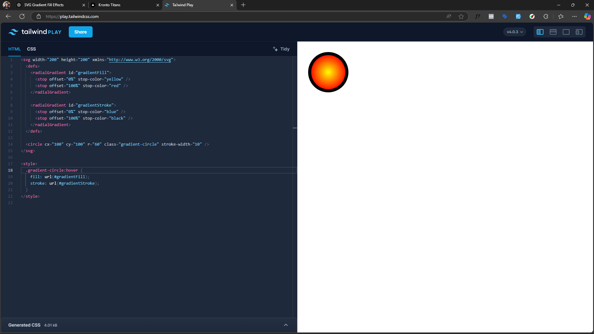

# Apply SVG Gradient element as CSS background image or fill



Yes, you can apply a **radial gradient** to both the **fill** and **stroke** of an SVG using **CSS** and **SVG definitions**.

---

### **Using SVG `<radialGradient>` for Both Fill & Stroke**
You can define a `<radialGradient>` in `<defs>` and apply it to both the `fill` and `stroke` of an SVG shape.

#### ✅ **Example: Radial Gradient on Both Fill & Stroke**
```xml
<svg width="200" height="200" xmlns="http://www.w3.org/2000/svg">
  <defs>
    <!-- Define a radial gradient -->
    <radialGradient id="gradientFill" cx="50%" cy="50%" r="50%">
      <stop offset="0%" stop-color="yellow"/>
      <stop offset="100%" stop-color="red"/>
    </radialGradient>

    <!-- Define another radial gradient for stroke -->
    <radialGradient id="gradientStroke" cx="50%" cy="50%" r="50%">
      <stop offset="0%" stop-color="blue"/>
      <stop offset="100%" stop-color="black"/>
    </radialGradient>
  </defs>

  <!-- Apply the gradients to fill and stroke -->
  <circle cx="100" cy="100" r="60" fill="url(#gradientFill)" stroke="url(#gradientStroke)" stroke-width="10"/>
</svg>
```
🔹 The `fill` uses **yellow to red radial gradient**  
🔹 The `stroke` uses **blue to black radial gradient**  

---

### **Using CSS to Apply the Gradients (For Inline SVG Only)**
You can reference the gradient inside a `<style>` block.

#### ✅ **Example: Apply via CSS**
```xml
<svg width="200" height="200" xmlns="http://www.w3.org/2000/svg">
  <defs>
    <radialGradient id="gradientFill">
      <stop offset="0%" stop-color="yellow"/>
      <stop offset="100%" stop-color="red"/>
    </radialGradient>

    <radialGradient id="gradientStroke">
      <stop offset="0%" stop-color="blue"/>
      <stop offset="100%" stop-color="black"/>
    </radialGradient>
  </defs>

  <circle cx="100" cy="100" r="60" class="gradient-circle" stroke-width="10"/>
</svg>

<style>
  .gradient-circle {
    fill: url(#gradientFill);
    stroke: url(#gradientStroke);
  }
</style>
```

> **⚠️ Important:** CSS `fill: url(#id)` only works for **inline SVGs**, not external ones.

---

### **Alternative: Using `stroke-opacity` for a Transparent Stroke**
If you want a **see-through stroke with a gradient effect**, you can use `stroke-opacity`:

```xml
<circle cx="100" cy="100" r="60" fill="url(#gradientFill)" stroke="url(#gradientStroke)" stroke-width="10" stroke-opacity="0.7"/>
```

---

### **Can You Apply Gradients via CSS for External SVGs?**
Not directly. But you can use **CSS masking** with `mask-image` or `-webkit-mask-image` to overlay a gradient.
